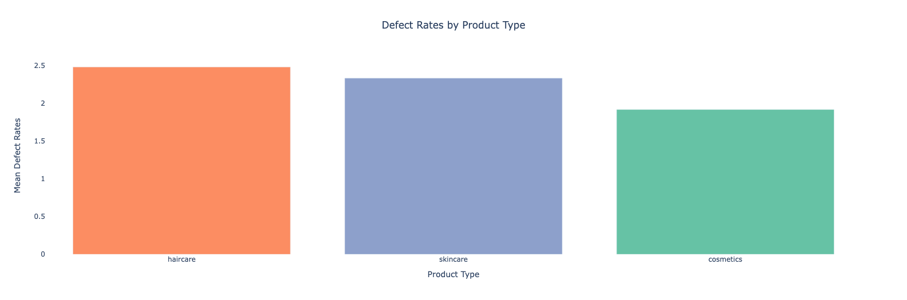

# Supply-Chain-Analytics

This project conducts a comprehensive supply chain data analysis using dataset wiht 100 rows, 24 columns. 

In the Exploratory Data Analysis phase, performed data quality control checks, assessed supply chain risks, analyzed inventory using the Economic Order Quantity (EOQ) method, conducted customer segmentation, and examined lead times optimization. 

# Results:
# EDA

.png)

 

However, during the modeling phase, LightGBM and RNN models proved ineffective due to the small dataset size of 100 rows and 24 columns, leading to poor results. 

To improve cost optimization and demand forecasting, using a larger dataset or exploring alternative methods such as linear regression, LSTM, FB Prophet, XG Boost or random forests would be suitable.
